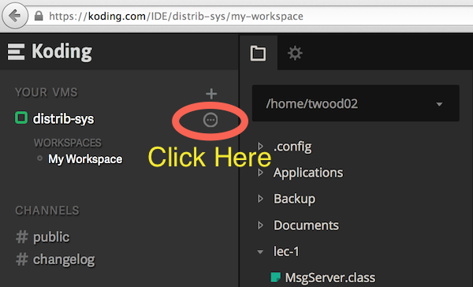

# Lec 1: The Simplest Distributed System


In this exercise you will build the simplest type of distributed system---a client/server application.

#### A very simple Message Board
Our program will do the following:

The **server** acts as message board; it will print out any messages that are sent to it along with the name of the sender.

The **client** connects to the server and sends its name and the message it wants printed.  After that it disconnects. The server does not send anything back to the client: I told you this was very simple!

**IMPORTANT:** *During this exercise you* **may NOT** *go to any websites except this page, and those listed in the "Allowable Links" sections below.*  **Visiting any other website is cheating!**

## Getting the code
*Everyone in your group should do this!*

Before you can begin you need to get a copy of the sample code.
  * Start your VM on Koding.com
  * in the terminal, run `git clone https://github.com/gwDistSys15/dist-sys-exercises.git`
  * run `cd dist-sys-exercises/lec-1/msgboard` to change to the directory containing all of the sample code for this exercise.

## Find your VM's hostname and IP
*Everyone in your group should do this!*

In order to connect to your VM from another computer you need to know its IP or hostname.  

**First,** open the *VM Settings* window by clicking the "..." icon next to your VM name on the left panel as shown in this screenshot:



On the first page of the popup window will be a table with your *Public IP* and *Assigned URL*.  Make a note of your IP.  

**Second**, click on the *Domains* tab of the settings window and click the slider to enable the domain "yourusername.koding.io".  This will allow you to easily access your VM with the host name `yourusername.koding.io`

## Starting the Server
*Select one of the students in your group to run the server. Only she or he needs to follow these directions*

The provided server is written in Java so you will need to compile and then run the program as follows.
```
cd server              # change to the server/ directory
javac MsgServer.java   # compile the code
java MsgServer         # start the server
```

## Client 0: `telnet`
The first client you will use to connect to the server won't require any coding at all--you will use `telnet`.  Telnet is a very simple program that is useful for debugging network applications and protocols.  It simply sends and receives lines of data to and from a server.  To run telnet, run: `telnet HOST port`

This will open a TCP connection to the specified `HOST` (either an IP or hostname) and `PORT`.  If you type some text and hit enter, `telnet` will transmit that line of text to the server.  `telnet` is also always listening for messages coming from the server, and will print them out one line at a time.

Try sending a few messages to verify that your server is working.

**Once you know the server works, you can then try the different languages below in any order.**

## Client 1: Sockets in C
To create a socket in C, you first need to get an `addrinfo` struct for the host you want to connect to. This is accomplished with the function:

```
     getaddrinfo(const char *hostname, const char *servname,
             const struct addrinfo *hints, struct addrinfo **res);
```
The first argument is a string with the host name or IP, and the second is also a string (not an int like you might expect) with the service port.  The third argument provides parameters for the type of socket you want to create, and the final parameter will be filled in by the function if it is called successfully.

Here is a sample usage:

```
struct addrinfo hints, *server;

memset(&hints, 0, sizeof hints);
hints.ai_family = AF_INET;
hints.ai_socktype = SOCK_STREAM;

if ((rc = getaddrinfo(server_ip, server_port, &hints, &server)) != 0) {
        perror(gai_strerror(rc));
        exit(-1);
}
```

Once you have a valid `addrinfo` for your server, you can create a socket and connect it:

```
int sockfd = socket(server->ai_family, server->ai_socktype, server->ai_protocol);
if (sockfd == -1) {
        perror("ERROR opening socket");
        exit(-1);
}
rc = connect(sockfd, server->ai_addr, server->ai_addrlen);
if (rc == -1) {
        perror("ERROR on connect");
        close(sockfd);
        exit(-1);
}
```

Now your socket is connected, so you can `send` and `recv` data with the socket file descriptor returned by the `socket()` function.  Here are the function definitions from `man send` and `man recv`

```
ssize_t send(int socket, const void *buffer, size_t length, int flags);

ssize_t recv(int socket, void *buffer, size_t length, int flags);
```

Both return the amount of data sent or received, and take arguments indicating the socket to send/recieve on, the data to send or a buffer to receive into, the length of data, and flags (which you can set to 0).

**Try to edit the `c/msg_client.c` file to correctly connect to your Message Board server and send it a name and message.**

Allowable links (**you may not go to any websites except these**):
  * [C for java programmers](http://www.cprogramming.com/java/c-and-c++-for-java-programmers.html)
  * [getaddrinfo API](http://beej.us/guide/bgnet/output/html/multipage/getaddrinfoman.html)
  * [socket API](http://beej.us/guide/bgnet/output/html/multipage/socketman.html)
  * [connect API](http://beej.us/guide/bgnet/output/html/multipage/connectman.html)
  * [send](http://beej.us/guide/bgnet/output/html/multipage/sendman.html) and [receive](http://beej.us/guide/bgnet/output/html/multipage/recvman.html) APIs

## Client 2: Sockets in Java
Using sockets in Java is a bit simpler than C.  You simply need to create a `Socket` object. The simplest constructor for this class takes parameters for the host name and port:
```
public Socket(String host, int port)
       throws UnknownHostException, IOException

Creates a stream socket and connects it to the specified port number on the named host.

Parameters:
    host - the host name, or null for the loopback address.
    port - the port number.
```

Be careful--since instantiating this class can cause an exception to be thrown, you will have to put this code inside a `try / catch` block.

Once your socket is created, you use this with a PrintWriter object (which you've probably used for basic File I/O in the past). This code will create a new `PrintWriter` using the output stream of the socket and set the writer to automatically flush data (i.e., send it out the socket):
```
// sock must be a Socket object
PrintWriter out = new PrintWriter(sock.getOutputStream(), true);
```

Now that you have a `PrintWriter`, you can use functions like `out.println("Hello World")` to have it send a string plus a new line character to the server.

If you also want to read from the socket to receive data, you would need to create a `BufferedReader` object.  We'll save that for another day.

**Try to edit the `java/MsgClient.java` file to correctly connect to your Message Board server and send it a name and message.**


Allowable links:
  * [Java beginners tutorials](http://docs.oracle.com/javase/tutorial/java/index.html)
  * [Java Socket API](http://docs.oracle.com/javase/7/docs/api/java/net/Socket.html)
  * [Java PrintWriter API](http://docs.oracle.com/javase/7/docs/api/java/io/PrintWriter.html)
  * [Java BufferedReader API](http://docs.oracle.com/javase/7/docs/api/java/io/BufferedReader.html)

## Client 3: Sockets in Python
Python makes using sockets even easier (or at least with less code).

To create a socket in Python you create a socket object:
```
import socket

clientsocket = socket.socket(socket.AF_INET, socket.SOCK_STREAM)
```

This socket object then exposes functions to `connect`, `send`, and `recv`.  The `connect` function takes a tuple `(hostname, port)` while `send` simply takes a string of the text to be sent.

**Try to edit the `python/msgclient.py` file to correctly connect to your Message Board server and send it a name and message.**


Allowable links:
  * [A basic Python tutorial](http://www.stavros.io/tutorials/python/)
  * [Python Socket API](https://docs.python.org/2/library/socket.html#socket.socket)
  * Python [send](https://docs.python.org/2/library/socket.html#socket.socket.send) and [recv](https://docs.python.org/2/library/socket.html#socket.socket.recv)
  * [Python Socket How To](https://docs.python.org/2/howto/sockets.html#socket-howto)
